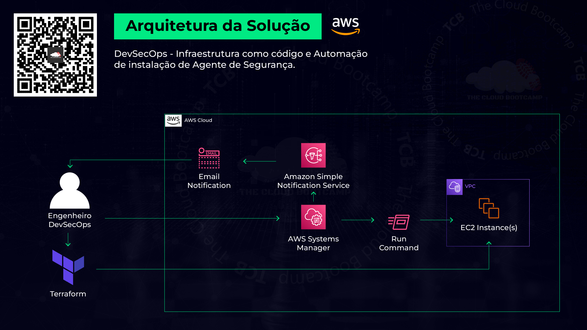

# implementacao-terraform
Implementação de um conjunto de instâncias EC2 utilizando o Terraform e configuração do AWS Systems Manager fazendo uso do Amazon Simple Notification Service para instalação automatizada de agentes de segurança

Nesse projeto baseado em um cenário do mundo real, atuei como Engenheiro de DevSecOps, onde implementei um conjunto de instâncias EC2 e a infraestrutura de forma automatizada utilizando Terraform (infraestrutura como código — IaC). Além disso, foi necessário instalar um agente de segurança específico e de forma automatizada em todas as instâncias.

Uma vez que provisionei a infraestrutura, foi utilizado o AWS System Manager e seu componente Command Run para a instalação dos agentes de segurança de forma automatizada. Fiz uso do Amazon Simple Notification Service — SNS para enviar um e-mail informando que todo o processo foi concluído com sucesso.



Primeiro passo do projeto foi fazer o download dos arquivos que usei para criar as instâncias pelo Terraform, abri os arquivos no VsCode para editá-los, e colocar as informações do seu ambiente na AWS.

Após isso abri o Aws CloudShell para importar os arquivos e instalar o Terraform, para executar os comandos e criar as duas instâncias EC2.

Depois de instalado foi só executar os comandos:

```
terraform init
terraform plan
terraform apply
```

Com isso as duas instâncias EC2 foram criadas.


Depois criei uma notificação no Amazon Simple Notification Service — SNS


Após a notificação criada, foi necessário fazer as configurações no AWS System Manager para realizar as instalações dos agentes de segurança de forma automática.


Com isso finalizamos as configurações necessárias e cada evento que acontecer nas instâncias EC2, será notificado via e-mail.


Esse projeto foi bastante interessante de trabalhar, pois te dá uma visão totalmente diferente de como você pode provisionar recursos de forma simples e de alta escala de forma simples e rápida.


